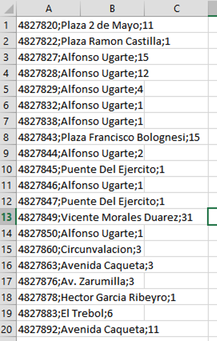
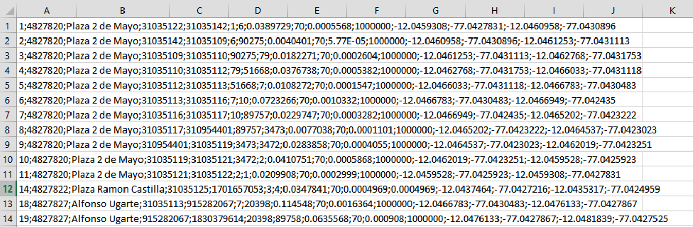
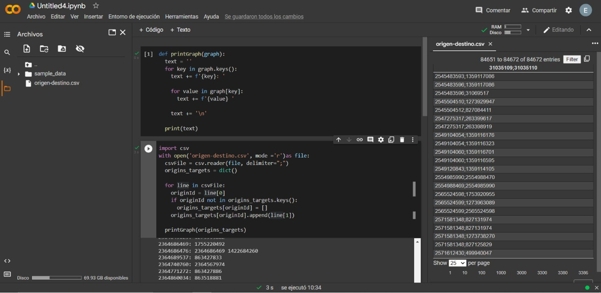
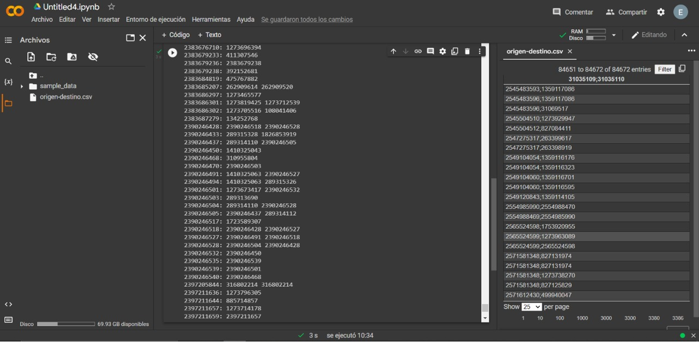
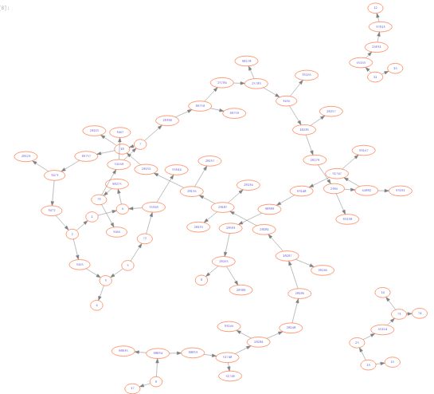
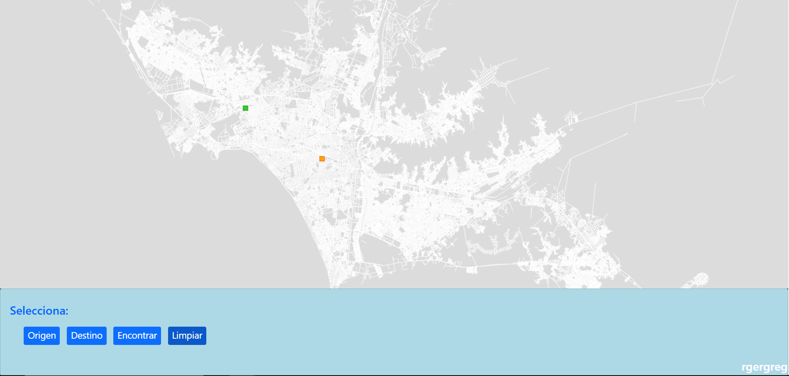
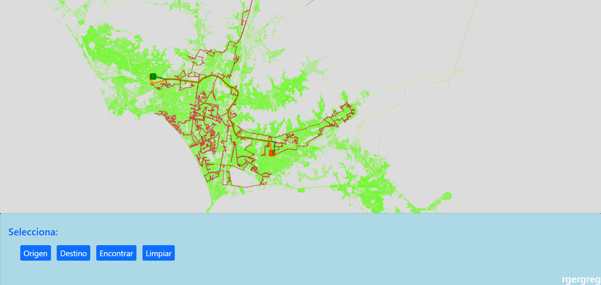

<br />

# **Complejidad Algorítmica**


### **Trabajo Final**
<br/>

### **Docente:**
Luis Martin Canaval Sánchez
<br/><br/>

### **Integrantes:**

- Diego Alonso Olivera Barrantes (u201914246)
- Elizabeth Adriana Nina Gutiérrez (u201920247)
- Manuel Alonso Aranguri Vargas (u201911572)
<br/>

### **Sección:** 
CC41

<br />

---
<br />

## **Índice**
- [Resumen ejecutivo](#resumen)
- [Área elegida](#area-el)
- [Descripción de datos consignados por calle](#datos-calle)
- [Descripción de datos consignados por intersección](#datos-inters)
- [Explicación de la elaboración del grafo](#desc-grafo)

<br />

## **Resumen ejecutivo**<a id="resumen"></a>
Este proyecto tiene como objetivo realizar un grafo mediante una lista de adyacencia con información real de las intersecciones de las calles y avenidas de algún lugar real. Esto con la intención de aplicar algoritmos de recorrido de grafos que permitan encontrar el camino más eficiente para llegar desde un punto de origen hasta un punto de destino teniendo en cuenta factores como distancia, congestión vehicular, máxima velocidad permitida por carretera, entre otros. 
<br /><br />

## **Área elegida**<a id="area-el"></a>
Para escoger el área donde recolectar la información se tuvo que buscar una que cumpliera algunos requisitos. Entre estos se encuentran que debe tener como mínimo 1 millón de habitantes y que tenga una sección que ronda las 1500 cuadras como mínimo. En este caso nuestro grupo escogió la ciudad de Lima, la cual supera los requisitos mínimos, llegando a tener más de  9 millones de habitantes.


<br /><br />

## **Descripción de datos consignados por calle**<a id="datos-calle"></a>
Los datos consignados por calle están adjuntados como un archivo llamado “Lima-calles.csv”. En este archivo podemos encontrar la información de todas las calles de Lima donde los datos de cada calle están separados por filas. De cada calle se presentan 3 datos: el ID de la calle, el nombre de la calle y la cantidad de intersecciones que contiene esa calle.


<br /><br />

## **Descripción de datos consignados por intersección**<a id="datos-inters"></a>
Los datos consignados por calle están adjuntados como un archivo llamado “Lima-intersecciones.csv”. En este archivo podemos encontrar la información de todas las intersecciones de las calles de Lima donde los datos de cada intersección están separados por filas. De cada intersección se presentan 15 datos: el ID del registro, el ID de la calle, los IDs de origen y destino de la intersección, el origen y destino de la intersección, la distancia en Km, la velocidad en Km/h, el costo, el costo inverso y las coordenadas de la intersección.


<br /><br />

## **Explicación de la elaboración del grafo**<a id="desc-grafo"></a>
Para la elaboración del grafo se usó una lista de adyacencia la cual se adjunta como un archivo llamado “Lima-lista_adyacencia.txt”. Para construir esta lista, primero se tuvo que recolectar los datos de las rutas e intersecciones de la ciudad elegida. Para ello, tuvimos que acudir a una herramienta externa, la cual nos generó una base de datos con la información que se necesitaba. Luego exportamos la base de datos en formato csv. Finalmente, con ayuda de python realizamos un algoritmo que lee el archivo de la base de datos y con los IDs de las calles de origen y destino genera la lista de adyacencia. El formato con el que hemos trabajado para la lista de adyacencia es indicar el ID de la calle de origen y a continuación se coloca 2 puntos y todas las calles con las que se intersecta (calles destino). 
Implementamos el siguiente algoritmo para obtener la lista de adyacencia que usaremos para construir nuestro grafo.
<br />



<br />
Dando como resultado lo siguiente:

<br />



<br>

### Visualización de grafo 



<br>

## Implementación de algorimos

Para esta entrega utilizamos los siguientes 3 algoritmos de ordenamiento


Ruta principal
```python
def dijkstra(G, s):
    n = len(G)
    visited = [False]*n
    path = [-1]*n
    cost = [math.inf]*n

    cost[s] = 0
    pqueue = [(0, s)]
    while pqueue:
        g, u = hq.heappop(pqueue)
        if not visited[u]:
            visited[u] = True
            for v, w in G[u]:
                if not visited[v]:
                    f = g + w
                    if f < cost[v]:
                        cost[v] = f
                        path[v] = u
                        hq.heappush(pqueue, (f, v))

    return path, cost
```

Rutas alternativas 
```python
def bfs(G, s):
  n = len(G)
  visited = [False]*n
  path = [-1]*n # parent
  queue = [s]
  visited[s] = True

  while queue:
    u = queue.pop(0)
    for v, _ in G[u]:
      if not visited[v]:
        visited[v] = True
        path[v] = u
        queue.append(v)

  return path
```


```python
def dfs(G, s):
  n = len(G)
  path = [-1]*n
  visited = [False]*n
  
  stack = [s]
  while stack:
    u = stack.pop()
    if not visited[u]:
      visited[u] = True
      for v, _ in G[u]:
        if not visited[v]:
          path[v] = u
          stack.append(v)

  return path
```


<br>


## Implementación de interfaz para vizualización 

Para nuestro trabajo final, utilizamos el siguiente repositorio como base para la implementación de interfaz: 

>.- Repositorio: https://github.com/lmcanavals/acomplex/tree/main/tfbase  

Dando como resultado las siguientes imagenes: 

Dibujo del grafo antes



Dibujo del grafo despues




## Enlace de video de exposición

> Video de exposición: https://youtu.be/qil6ue9MIVw